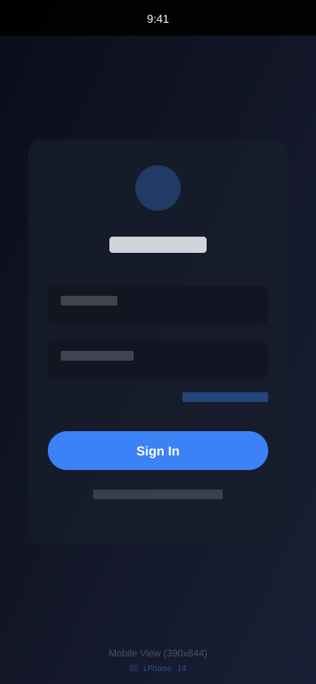
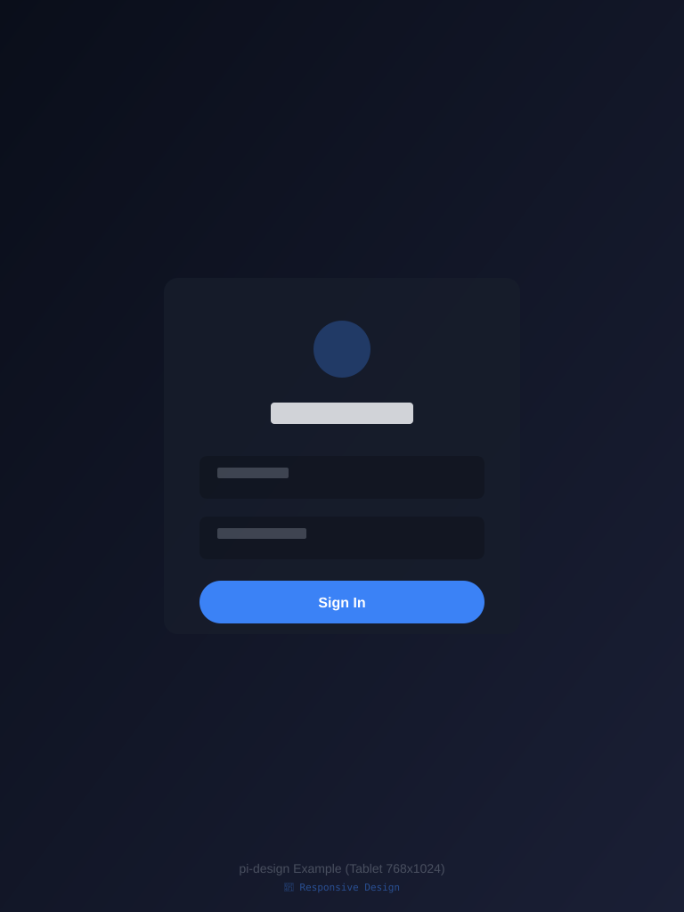
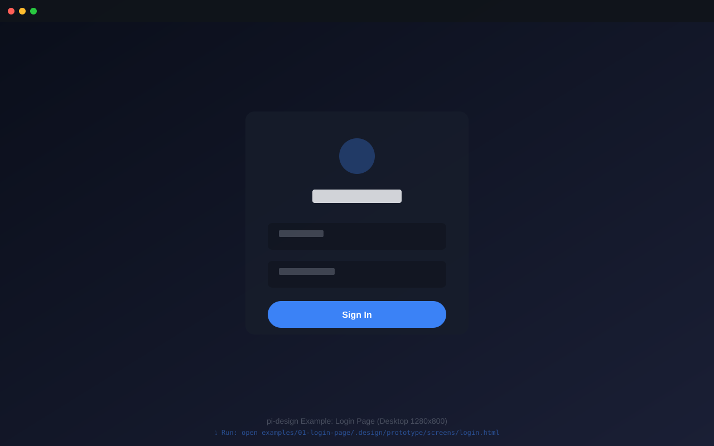

# pi-design

A [Pi](https://github.com/earendil-works) extension that turns a design brief into shipped UI:

`/design <brief>` → the model autonomously produces a high-fidelity HTML prototype and iterates on it → a human reviews it in a local browser → once approved, the prototype becomes the spec for implementing real UI in your target stack.

## 🚀 [Quick Start (5 minutes)](./QUICKSTART.md) | 📚 [Examples](./examples/) | 🗺️ [Roadmap](./ROADMAP.md) | 📸 [Screenshots](./docs/SCREENSHOT_GUIDE.md)

## 📸 See It In Action

<table>
  <tr>
    <td width="30%" align="center">
      <br/>
      <sub>📱 Mobile (390x844)</sub>
    </td>
    <td width="35%" align="center">
      <br/>
      <sub>📱 Tablet (768x1024)</sub>
    </td>
    <td width="35%" align="center">
      <br/>
      <sub>💻 Desktop (1280x800)</sub>
    </td>
  </tr>
  <tr>
    <td colspan="3" align="center">
      <sub><em>Example: Login page from <code>/design 一个简约登录页面</code></em></sub><br/>
      <sub>👉 <a href="examples/01-login-page/">View full example</a> | <a href="examples/01-login-page/.design/prototype/screens/login.html">Open live preview</a></sub>
    </td>
  </tr>
</table>

> **💡 Tip:** These are placeholder diagrams. Generate actual screenshots by following the [Screenshot Guide](docs/SCREENSHOT_GUIDE.md).

## How It Works

```text
BRIEF → PLAN → BUILD → SELF-REVIEW (≤3 rounds/screen) → REVIEW (human gate) ─┬→ rejected + feedback → BUILD
                                                                             └→ approved → IMPLEMENT → done
```

The model is the sole executor. The extension only provides three tools plus a review feedback channel — all workflow logic lives in the prompt state machine in `extensions/prompt.ts`.

## Features

- **Autonomous prototyping** — the model plans screens, builds each one as a standalone HTML file, screenshots it headlessly, critiques its own render, and fixes it (at most 3 self-review rounds per screen).
- **Human gate as a hard boundary** — `design_review` returns `terminate: true`, so the agent stops after submitting for review instead of relying on model self-restraint.
- **Review page that outlives the session** — the review server runs in a detached subprocess. The review URL stays reachable even after the session exits; decisions are persisted to disk and picked up by the next session.
- **Stable review URL** — fixed default port (3374), a per-workflow token, so your browser tab stays valid across reject–revise–resubmit loops.
- **DESIGN.md design system** — normalized design tokens in YAML front matter (aligned with the [Google Labs DESIGN.md spec](https://github.com/google-labs-code/design.md)), deterministically projected to `tokens.css`, with mechanical linting before the review gate opens.
- **Motion designed with the UI** — durations/easings are first-class tokens (`motion.duration.*` / `motion.easing.*` → `--motion-*`), every screen animates through them (declarative CSS/WAAPI only), and the review surfaces can **play** the result: replay, pause, and ½×/¼× slow-mo, per screen or globally.
- **Multi-viewport self-check** — optional extra viewports so every screen is re-rendered and verified for responsive layout.
- **Target-stack implementation** — the approved prototype is translated to React, SwiftUI, or plain web, using design tokens as the single source of truth.

## Installation

```bash
pi install git:github.com/TengYangTuoHai/pi-design@v0.1.0   # or npm:/local: sources
# For development, load directly:
pi --extension ./extensions/index.ts
```

Dependencies:

- The only runtime dependency is `playwright-core` (no browser download). It prefers driving an already-installed Chrome/Edge via `channel: "chrome"`, and falls back to bare `chrome --headless --screenshot` (zero-dependency path) when Playwright's browser is unavailable. If neither exists, it errors with a hint to install Chrome or set `PI_DESIGN_CHROME`.
- Host packages such as `@earendil-works/pi-coding-agent` are provided by Pi and declared as `peerDependencies`.

## Usage

```text
/design a minimal login page: email + password + sign-in button   # start / reset the workflow (back to BRIEF)
/design stop                                                      # end the workflow and disable the design tools
```

While the workflow is active, the review page opens in your browser (approve / reject + feedback). You can also reply "approved" or your feedback directly in the chat — both are equivalent. The verdict flows back into the session as a user message and keeps driving the state machine.

## DSH adapter (Path A: skill + CLI)

The same workflow runs inside [DSH](https://github.com/deepseek-ai) (or any agent with a shell and a `read_image`-style image tool) without the Pi extension runtime. The Pi-coupled surface (`extensions/index.ts`) is replaced by a standalone CLI that reuses every Pi-free module (`server.ts`, `shot.ts`, `designmd.ts`, `prompt.ts`) directly — no build step, requires Node ≥ 23.6:

```bash
node dsh/cli.mjs start "<brief>" [--scope app|component]
                                         # reset + print the full workflow state machine
node dsh/cli.mjs render screens/x.html [--at 150]
                                          # headless screenshot → view with read_image
                                          # (--at MS: capture a mid-animation frame)
node dsh/cli.mjs review                  # DESIGN.md lint + regenerate & open the playground → STOP
node dsh/cli.mjs playground              # (re)generate + open the playground (read-only)
node dsh/cli.mjs status --stage build    # persist transitions (+ stage rules re-injection)
node dsh/cli.mjs stop                    # end the workflow
node dsh/cli.mjs install-skill [dir]     # write a DSH SKILL.md pointing at this CLI
```

`install-skill` (default target `~/.dsh/skills`) bakes the absolute CLI path into the skill named `design`, so `/design <brief>` works in the DSH composer like on Pi (DSH skills are `/`-invocable; the project `.dsh/skills/` root beats the user root). What maps where: `design_render` → `render` + the agent's image tool; the human gate → `review` **(re)generates `.design/playground.html`** — a self-contained static page (pure `file://`, no server/token/port) showing every current screen in one view with viewport presets (375/390/768/1280), zoom, per-screen full-screen, self-review-shot compare, and motion playback (▶ 重播 / ⏸ 暂停 / ½× ¼× slow-mo, per-screen ↺) — and the **verdict is given in chat**: explicit approval → `status --stage implement`, comments → `status --stage build`. `playground` reopens the view anytime without touching workflow state. (In Pi the review server + browser buttons + `sendUserMessage` loop automates the verdict; DSH path A deliberately drops that machinery — the browser only shows the design.) `design_review`'s `terminate: true` becomes an explicit end-your-turn instruction (prompt discipline, not a hard boundary); per-turn `promptGuidelines` → re-printed stage rules on every `status` call (compaction-safe). Scope: `--scope component` restricts the whole workflow to a single component (+ its variants) — one showcase page, one reusable component at IMPLEMENT, no app scaffolding; a scope guard in the workflow prompt self-corrects a misclassified brief. Set `PI_DESIGN_NO_BROWSER=1` to suppress browser opening (CI/tests). Known limitations: with a model that cannot view images, self-review falls back to the token-by-token code audit documented in the workflow prompt; and under DSH's default file sandbox the raw-chrome screenshot fallback may fail to create its temp profile (the playwright engine — the default — works fine, so this only matters when playwright-core is unavailable).

## Project conventions (`.design/`)

```text
.design/
  DESIGN.md           # design identity, following the Google DESIGN.md spec (see below)
  tokens.css          # CSS variables deterministically projected from the DESIGN.md front matter (derived)
  config.json         # { "target": "swiftui"|"react"|"web", "viewport": [390,844], "viewports": [[768,1024]] }
  state.json          # workflow state (maintained by the extension; enables resume)
  review-server.json  # review gate runtime info (while the detached server lives; transient)
  review-round-*.json # persisted review verdicts (waiting for the session to pick up; transient)
  prototype/
    index.html        # navigation shell (iframes each screen + desktop/phone frames)
    motion.js         # auto-generated motion playback runtime (review tooling; never hand-edit)
    screens/*.html    # one file per screen (each includes <script src="../motion.js"></script>)
  shots/              # screenshot cache (recommended to .gitignore)
```

### The DESIGN.md spec (Google Labs)

Aligned with [google-labs-code/design.md](https://github.com/google-labs-code/design.md): the YAML front matter carries **normalized design tokens** (`colors` / `typography` / `rounded` / `spacing` / `motion` / `components`, where component values may reference `{colors.primary}`), and the Markdown body explains the design rationale in a fixed section order (Overview → Colors → Typography → Layout → Elevation & Depth → Motion → Shapes → Components → Do's and Don'ts). The front matter is the single source of truth for all values; `tokens.css` is derived by deterministic mapping (`colors.primary` → `--color-primary`, `typography.h1.fontSize` → `--type-h1-size`, `motion.duration.fast` → `--motion-duration-fast`, `motion.easing.standard` → `--motion-easing-standard`, `components.button-primary.backgroundColor` → `--component-button-primary-background`, …).

Before the `design_review` gate opens, a **mechanical lint** runs (built in, `extensions/designmd.ts`, no network required):

- **errors (block the gate)**: missing/unparseable front matter, unresolved token references, duplicate sections
- **warnings (surfaced to the reviewer)**: missing primary color or typography, orphan colors, component contrast below WCAG AA (4.5:1), out-of-order sections, `tokens.css` out of sync with the front matter, motion tokens without a `## Motion` inventory, a `## Motion` section that ignores reduced motion, malformed motion values (durations that aren't `ms`/`s`, easings that aren't curves)

`viewport` is the primary viewport; the optional `viewports` array (≤ 3) declares extra self-check viewports — during SELF-REVIEW each screen gets one screenshot per viewport to confirm responsive layout. Screenshots are named `<screen>@<w>x<h>-<timestamp>.jpg`, keeping the latest 3 per viewport.

## Motion design & playback

Motion is designed **with** the UI, in the same workflow pass — not bolted on afterwards:

1. **Tokens** — `motion.duration.*` (e.g. `fast: 150ms`, `normal: 300ms`) and `motion.easing.*` (e.g. `standard: cubic-bezier(0.2, 0, 0, 1)`) live in the DESIGN.md front matter next to colors/typography and project into `tokens.css` as `--motion-*` variables. Pages may only animate through those variables — magic durations/easings are forbidden, exactly like magic colors.
2. **Build rules** (enforced by the re-printed stage guidelines): entrances, state changes, and micro-interactions are implemented as declarative CSS transitions/animations (or WAAPI) — never rAF/`setInterval` tick loops, so the tooling can control them; every screen carries a `prefers-reduced-motion` fallback; the per-screen motion inventory (trigger → what moves → duration/easing) is documented in DESIGN.md's `## Motion` section.
3. **Playback runtime** — the tooling auto-generates `.design/prototype/motion.js` (on `start`, `render`, `review`, `playground`); every screen includes `<script src="../motion.js"></script>` before `</body>`. It listens for `postMessage` commands (`replay` / `pause` / `play` / `rate`) and drives every animation on the page through the Web Animations API, including ones created later (hover transitions) via a light keep-alive re-sync.
4. **Playback surfaces** — both the Pi review page and the DSH `playground.html` ship motion controls: ▶ 重播 (all screens), ⏸ 暂停 / □ 继续, ½× / ¼× slow-mo, and a per-screen ↺ 重播. Screens carrying the runtime ACK (plus a `ready` ping on load) and get smooth in-place control; screens without it fall back to an iframe reload for replay and are flagged for pause/slow-mo being unavailable — old prototypes keep working.
5. **Self-review of motion** — screenshots settle entrance animations before capture (deterministic end state); `design_render`'s `atMs` / `render --at <ms>` captures a mid-animation frame (e.g. `--at 150`) so the model can verify timing against the `## Motion` inventory.
6. **IMPLEMENT** — motion tokens translate like any other token (theme layer / `DesignTokens.swift` / global custom properties), animations reproduce through the target's native mechanism (CSS, SwiftUI `.animation(_:value:)` with `accessibilityReduceMotion` respected, …), and the `motion.js` runtime is deliberately **not** ported — it's review tooling, not product code.

## IMPLEMENT translation rules (per target)

The full rules live in `IMPLEMENT_TARGET_RULES` in `extensions/prompt.ts`. They are injected into the workflow prompt, the review-approved feedback message, and every turn during the IMPLEMENT stage (so they survive compaction). All model-facing prompts are English (tool descriptions, result texts, and errors included); human-facing surfaces (the review page, TUI notifications) remain in Chinese. Highlights:

- **react**: scout the target project first (framework / styling approach / naming conventions), translate design tokens (front matter as source, `tokens.css` as projection) into the project's theme layer (Tailwind theme / `:root` variables / theme object), one page component per screen, local `useState` only, no new dependencies, and finish by running the project's own build/lint.
- **swiftui**: tokens → `DesignTokens.swift` (`Color(hex:)` or `Color(red:green:blue:)` with original values in comments); vertical/horizontal/overlay stacks → V/H/ZStack; one `struct <Screen>View` + `#Preview` per screen; native components and SF Symbols; run `swift build` to verify when a toolchain is available.
- **web**: scout the template and CSS organization, merge tokens into the project's global custom properties, semantic markup, no frameworks or build step.

All three targets have been verified end-to-end with real models (a Vite React TS project, a Swift Package project, a static site project): the react output had 64 `var(--)` usages with zero magic values and a passing `vite build`; the swiftui output passed `swift build` with zero warnings; the web output had tokens copied into the project, all page styles on `var(--)`, and zero magic values outside `:root`.

## The review page

Each review round happens on a local page at a fixed port (opened automatically in your default browser). **The review URL stays the same for the entire workflow**: default port 3374 ("DESI"), incrementing up to 25 times when occupied, falling back to random only when all are taken. The token is stable per workflow and rotates when the workflow ends — your browser tab keeps working across reject–revise–resubmit loops:

- **Reachable after the session exits**: the server runs in a detached subprocess; one-shot/print/RPC modes exiting right away don't affect it. Clicking approve/reject persists the result; a running session picks it up within seconds, and a session started later picks it up automatically (the server auto-closes after 30 minutes of inactivity).
- Viewport presets (375 / 390 / 768 / 1280, keys 1–4) and 25%–100% zoom, so wide prototypes can be reviewed full-screen.
- Motion playback: ▶ 重播 / ⏸ 暂停 / ½× ¼× slow-mo for all screens at once, plus a per-screen ↺ 重播 (see [Motion design & playback](#motion-design--playback)).
- Each screen can be opened full-screen in a new tab (↗) or compared against the model's latest self-review screenshot (📸).
- Keyboard shortcuts: `A` approve · `R` reject · `/` focus the feedback box.
- The decision endpoint is single-use; the page shows a "you can close this" hint after submitting.

## Architecture & key decisions

| Decision | Implementation |
|---|---|
| Human gate as a hard boundary | The `design_review` tool result returns `terminate: true`; the agent skips automatic follow-up after that batch — no reliance on the model stopping on its own |
| Review gate survives the session | The review server runs in a detached subprocess (Node ≥ 23 runs `.ts` natively; older environments fall back to in-process). One-shot/print/RPC modes exiting immediately don't affect reachability. Verdicts persist to `.design/review-round-<n>.json`; a running session polls every 1.5s, and a session started later picks them up automatically |
| Review feedback loop | Review page button → local server → `pi.sendUserMessage()` (equivalent to the user speaking; always triggers a turn) |
| Cross-turn state continuity | The design tools are only visible while the workflow is active (`pi.setActiveTools()`), and their `promptGuidelines` carry the state machine rules; `before_agent_start` injects the current stage into `systemPromptOptions.promptGuidelines` every turn — survives compaction |
| Resume | State persists to `.design/state.json`; on `session_start`, tool visibility is restored and offline verdicts are picked up |
| Screenshot feedback | `design_render` attaches screenshots directly as `ImageContent` in the `AgentToolResult.content` (officially supported at the type level) |
| No-TUI compatibility (RPC/wuhu) | All interaction goes through chat + browser (the default browser opens automatically); a failed `open` is not an error (the URL is always in the tool result) |

## Review server security model

This server is a local endpoint capable of injecting user messages into a full-permission agent session, and is treated as a hostile surface:

- Binds to `127.0.0.1` only; fixed default port 3374 (overridable via `PI_DESIGN_PORT`), incrementing when occupied, random only when all are taken;
- A 192-bit random token in the URL path, **stable per workflow** (the review URL never changes across rounds; rotates when the workflow ends); unknown tokens get an indiscriminate 404;
- `POST /decision` validates `Host` (must be `127.0.0.1`/`localhost:<port>`, guarding against DNS rebinding), `Sec-Fetch-Site` (cross-site rejected), and `Origin`;
- The decision endpoint is single-use; the server shuts down right after a decision, and auto-closes after 30 minutes idle;
- Static file serving is confined to `.design/`;
- `session_shutdown` performs idempotent cleanup.

## Development

```bash
npm run typecheck        # tsc --noEmit (strict + exactOptionalPropertyTypes)
npm run smoke            # smoke suites: server security matrix / dual screenshot engines / full extension pipeline / review page browser interaction (incl. motion playback) / DESIGN.md lint incl. motion rules / DSH CLI end-to-end
```

Note: on some external drives, npm silently fails to extract a few packages (typescript / jiti / typebox / pi-coding-agent may fail to unpack while npm still reports success). If `typecheck`/`smoke` report missing modules, download with `npm pack <pkg>@<version>` and extract manually into the matching `node_modules/` directory.

## Publishing (verified flow)

The `files` field limits published content to `extensions/` + `README.md` + `LICENSE` (8-file tarball / ~22 KB). The local install chain has been verified:

```bash
npm pack                                            # produces the tgz
mkdir /tmp/pkg && tar xzf pi-design-0.1.0.tgz -C /tmp/pkg
cd /tmp/pkg/package && npm install --omit=dev       # self-contained (peerDeps get installed too)
cd <target-project> && pi install /tmp/pkg/package -l   # project-local install
# First use in a project requires trust (~/.pi/agent/trust.json), otherwise project-level .pi/settings.json won't load
```

Once published to npm, users install with `pi install npm:pi-design`.

## Milestones

- [x] **M0** Fact-checking (tool-result image type confirmed; `sendUserMessage` triggers a turn; dual headless screenshot paths; `terminate` hard stop)
- [x] **M1** Skeleton: command / tools / state machine / screenshot feedback / self-iteration prompts
- [x] **M2** Review server + dual channel (button + chat text)
- [x] **M3** IMPLEMENT translation prompts tuned per target with real-model e2e (react / swiftui / web all passing)
- [x] **M4** Polish: multi-viewport (`config.viewports` + viewport-labeled screenshots), review page interactions (presets / zoom / shortcuts / screenshot compare), package publishing verified
- [x] **M5** Alignment with the Google [DESIGN.md spec](https://github.com/google-labs-code/design.md): normalized front-matter tokens + deterministic `tokens.css` projection + mechanical lint before the review gate (real-model e2e: 0 errors / 2 warnings)
- [x] **M6** Detached review gate: the server runs in a detached subprocess, stays reachable after session exit, and verdicts persist across sessions (verified on real hardware: URL still 200 after process exit → curl approval → session restart auto-feedback completed the implementation)
- [x] **M7** Motion as a first-class deliverable: `motion` token group + `## Motion` lint in DESIGN.md, declarative-animation build rules with a `prefers-reduced-motion` fallback, the auto-generated `motion.js` playback runtime, replay/pause/slow-mo controls on both the review page and the DSH playground, mid-animation self-review (`atMs` / `--at`), and per-target IMPLEMENT motion rules — playback verified in a real browser (pause holds, slow-mo applies, replay rewinds)
- [x] **Fix**: the review page decision fetch once used a relative URL causing a doubled token 404 (the button path had been broken since M2); switched to root-relative paths with a browser-level regression test

## License

[MIT](./LICENSE)
